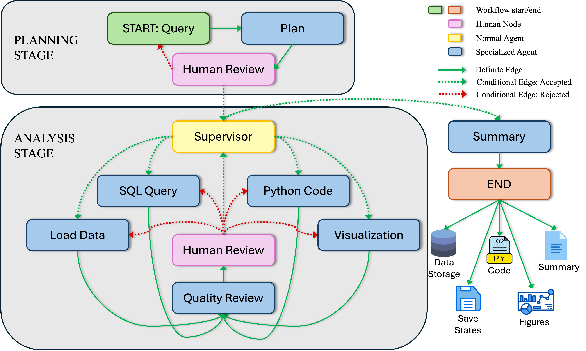

# InferA

## About InferA - Large-Scale Data Analysis
Inference through AI (InferA) is a data analysis multi-agent system. This project addresses the challenges of analyzing large-scale structured and numerical data using AI technologies. While LLM chatbots excel at language tasks, they struggle with massive datasets. We present a multi-agent system designed to overcome these limitations and automate complex data analysis workflows.

## Dataset

Our focus is on the HACC (Hardware/Hybrid Accelerated Cosmology Code) dataset, a terabyte-scale cosmological simulation suite. This dataset includes:
- Multiple terabytes of data
- Hundreds of timesteps
- Billions of cosmic objects
- Specialized file formats requiring expert interpretation

## Our Solution: Multi-Agent System

We've developed a multi-agent approach to break down complex data analysis tasks:
1. Planner Agent: Translates natural language queries into detailed execution plans
2. Supervisor Agent: Manages dynamic execution and task adjustments
3. Data Loading and SQL Agents: Handle staged data loading
4. Python Agent: Performs logic-intensive analysis and computation
5. Visualization Agent: Generates task-specific plots (e.g., Paraview visualizations)



## Key Features
- Human-in-the-Loop: Allows continuous human feedback and supervision
- State Persistence: Saves all generated outputs and states for easy "time travel"
- Metadata-Aware Reasoning: Uses RAG for context-aware column selection
- Sandboxed Code Execution: Ensures data integrity with read-only access to the main dataset
- Optimized Token Usage: Efficient agent communication (Average run: <40,000 tokens, ~$0.09 with GPT-4)

# Getting Started


# Contact


O# (O4923)

© 2025. Triad National Security, LLC. All rights reserved.

This program was produced under U.S. Government contract 89233218CNA000001 for Los Alamos National Laboratory (LANL), which is operated by Triad National Security, LLC for the U.S. Department of Energy/National Nuclear Security Administration. All rights in the program are reserved by Triad National Security, LLC, and the U.S. Department of Energy/National Nuclear Security Administration. The Government is granted for itself and others acting on its behalf a nonexclusive, paid-up, irrevocable worldwide license in this material to reproduce, prepare. derivative works, distribute copies to the public, perform publicly and display publicly, and to permit others to do so.


# Setting up local ollama

1. Installing ollama - follow the first part of these instructions: 
https://copdips.com/2025/03/installing-ollama-without-root.html
```
mkdir -p ~/src
cd ~/src
curl -L https://ollama.com/download/ollama-linux-amd64.tgz -o ollama-linux-amd64.tgz
mkdir -p ~/opt/ollama
tar -C ~/opt/ollama -xzf ollama-linux-amd64.tgz
```

2. Get a node with gpu. You should be allocated a node: eg cn111.
```
cd /<your_folder>/InferA
salloc -N 1 -p volta-x86
```

3. Start ollama: ~/opt/ollama/bin/ollama serve

4. Start a new terminal, connecting to the cluster and then to the node:
```
ssh <your_username>@darwin-fe.lanl.gov
ssh <allocated_node>
```

5. Pull the models you want to use e.g.
```
~/opt/ollama/bin/ollama pull nomic-embed-test:latest
or
~/opt/ollama/bin/ollama pull mistral-small3.1:latest
```

# Create a python environment

1. In your project ollama folder, python environment created via:
```
cd /<your_folder>/InferA
python -m venv venv_InferA
source venv_InferA/bin/activate
```

2. Make sure python environment is activated. Install modules using:
```
python -m pip install -r requirements.txt
```

# Add genericio module

1. If you haven't setup remote_gio_explorer yet, do that. I copied the genericio directory here to import.


# Running

1. Get a node with gpu
```
salloc -N 1 -p volta-x86
```

2. Start ollama: ~/opt/ollama/bin/ollama serve

3. Start a new terminal, connecting to the cluster and then to the node:
```
ssh <your_username>@darwin-fe.lanl.gov
ssh <allocated_node> # e.g ssh cn123
```

4. Load module and activate python environment
Load the following modules:

```
module load miniconda3/py312_24.11.1
module load openmpi/3.1.6-gcc_9.4.0
module load cuda/12.3.1 
module load cmake/3.29.2
```

```
cd /<your_folder>/
source venv_InferA/bin/activate
```

5. Run main.py or any of the test_*.ipynb

